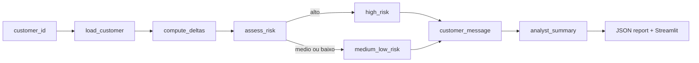

# Agente Monitorimento Credito

Um MVP de monitoramento de crédito construído com `LangGraph`, modelado como um fluxo de decisão com estado explícito para detectar deterioração de perfil, classificar risco e recomendar ação operacional.

## Visão Geral

O projeto simula um agente de monitoramento usado por times de crédito ou cobrança preventiva para responder perguntas como:

- o perfil do cliente piorou neste ciclo?
- a deterioração exige ação imediata?
- qual mensagem deve ser enviada ao cliente?
- o caso entra em monitoramento ativo ou acompanhamento assistido?

## Arquitetura



## Como o LangGraph entra na solução

O fluxo foi implementado com `StateGraph`, usando:

- `TypedDict` para o contrato de estado;
- nós especializados para cada etapa analítica;
- `conditional_edges` para roteamento por nível de risco;
- persistência do resultado final em `JSON`.

Isso faz o projeto funcionar como um pequeno `decision graph`, em vez de uma cadeia linear opaca.

## Estado do Grafo

O estado compartilhado inclui:

- `customer_id`
- `customer_profile`
- `score_delta`
- `utilization_delta`
- `risk_level`
- `monitoring_flags`
- `recommended_action`
- `customer_message`
- `analyst_summary`

## Nós do Fluxo

### `load_customer`
Carrega o perfil monitorado.

### `compute_deltas`
Calcula:
- variação do score;
- variação da utilização do crédito.

### `assess_risk`
Converte sinais de deterioração em:
- `risk_level`
- `monitoring_flags`

### `high_risk`
Define ação para casos que exigem intervenção imediata.

### `medium_low_risk`
Define ação para casos monitoráveis sem escalonamento crítico.

### `customer_message`
Gera uma mensagem customer-facing com linguagem mais acessível.

### `analyst_summary`
Consolida o caso em um resumo operacional para o time interno.

## Estratégia de Decisão

O risco é calculado por regras heurísticas:

- queda relevante de score aumenta risco;
- utilização alta ou crítica aumenta risco;
- atrasos recentes aumentam risco;
- registros negativos elevam a gravidade.

Depois, o score de risco é convertido em:

- `alto`
- `medio`
- `baixo`

## Estrutura do Projeto

- [src/graph_agent.py](/Users/flaviagaia/Documents/CV_FLAVIA_CODEX/agente_monitorimento_credito/src/graph_agent.py)
  - define o grafo, os nós e a execução principal.
- [src/sample_data.py](/Users/flaviagaia/Documents/CV_FLAVIA_CODEX/agente_monitorimento_credito/src/sample_data.py)
  - gera e carrega a base demo.
- [app.py](/Users/flaviagaia/Documents/CV_FLAVIA_CODEX/agente_monitorimento_credito/app.py)
  - interface em Streamlit para inspeção do fluxo.
- [main.py](/Users/flaviagaia/Documents/CV_FLAVIA_CODEX/agente_monitorimento_credito/main.py)
  - execução rápida do caso padrão.
- [tests/test_graph_agent.py](/Users/flaviagaia/Documents/CV_FLAVIA_CODEX/agente_monitorimento_credito/tests/test_graph_agent.py)
  - validação do fluxo principal.

## Execução Local

### Pipeline

```bash
python3 main.py
```

### Testes

```bash
python3 -m unittest discover -s tests -v
```

### Streamlit

```bash
streamlit run app.py
```

## Resultado Atual da Demo

No cenário padrão (`MON-1002`):

- `score_delta`: negativo
- `risk_level`: `alto`
- flags de deterioração presentes
- ação recomendada: monitoramento ativo com contato preventivo

No cenário mais crítico (`MON-1003`):

- `risk_level`: `alto`
- ação recomendada: monitoramento ativo com contato preventivo

## Próximas Evoluções

- checkpointer para histórico de monitoramento;
- nós adicionais para política de cobrança;
- integração com base transacional real;
- scoring supervisionado complementar;
- geração automática de fila operacional.

---

# English Version

`Agente Monitorimento Credito` is a `LangGraph` MVP for credit monitoring and early risk detection.

The project demonstrates:

- explicit stateful graph design;
- node-based analytical decomposition;
- conditional routing by risk level;
- customer-facing and analyst-facing outputs;
- Streamlit-based inspection of the graph result.
